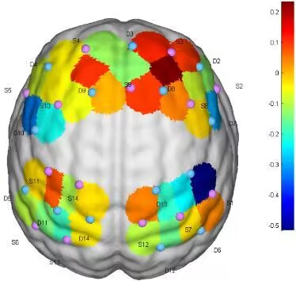
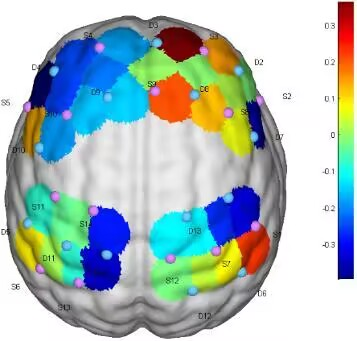

# RNR-TATD 康复护理机器人信任度评估试验数据库

Rehabilitation Nursing Robot-Trust Assessment Trial Database, 康复护理机器人信任度评估试验数据库（以下简称为“本数据库”）旨在为研究人员提供一个综合性数据资源，以研究和评估康复护理机器人在实际应用中的信任度。本数据库集成了多种数据类型，包括但不限于ED信任度量表、近红外数据、眼动数据，旨在促进康复机器人领域的研究和发展。

## 🚩数据集内容

本数据库包含以下数据类型：

- **ED信任度量表**：用于量化评估受试者对康复护理机器人信任度的问卷调查结果。
- **近红外数据**：记录近红外实验数据。
- **眼动数据**：记录受试者与康复护理机器人交互过程中的眼动追踪数据。
- 其他相关数据：可能包括可视化记录、视频记录等辅助研究数据。

## 🗝️使用指南

### 数据访问

请遵循以下步骤访问和使用数据库：

1. 克隆仓库到本地设备：
    ```
    git clone https://github.com/Dongjie-Cheng/RNR-TATD.git
    ```
2. 参考`README`, 查看所有可用的数据集。
3. 采用`Python`, `R`等语言分析数据

### 数据格式

数据主要以CSV、xlsx和图像文件格式提供。具体格式说明请参见各个子目录下的`README`文件。

## 💻环境要求

本项目数据可直接访问，无需特定的安装步骤。但建议使用以下软件或库来处理和分析数据：

- Python 3.8+
- Pandas库
- OpenCV库（用于处理视频数据）

## 可视化样例
 

## 🧡贡献

欢迎对本数据库进行贡献。如果您有任何建议、数据补充或改进，请通过Pull Requests或Issues与我们联系。

## 🔒许可证

本数据库以[MIT许可证](LICENSE)授权。使用本数据库之前，请确保您已经阅读并理解了许可证条款。

## 🤗联系方式

如果您有任何问题或想要进一步讨论本数据库，请通过以下方式联系我们：

- ✉️邮件: chengdongjiedev@outlook.com
- 🔗GitHub Issues: https://github.com/Dongjie-Cheng/RNR-TATD/issues

---
